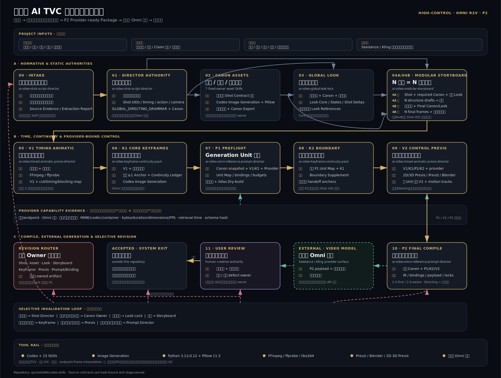

# High-Control AI TVC Production System

`codex-skills` 内显式 opt-in 的高控制全能参考 AI TVC 聚合兼容与维护
profile。仓库根目录的 17 个顶层 Skill 各自独立安装、发现、调用和验证；
每个包自己的 `SKILL.md`、资源与 package-local validator 才是该 Skill 的
运行权威。`high-control-ai-tvc` 不决定任何单包是否 available 或 ready。
当前 `all` profile 只管理 15 个 workflow 成员；manifest 的
`excluded_from_aggregate_profile` 条目只是被该 profile 排除，不进入聚合安装
或发布回执。仓库中的 17 个顶层包全部仍是 standalone Skill。

本目录只保存可选的批量安装、不可变 snapshot、aggregate preflight、跨包
兼容性验证、SOP 和流程图，不复制 Skill，也不保存客户项目。只有用户明确
选择 aggregate-managed workflow 时，manifest、receipt、release gate、
`AGGREGATE_READY_LATEST`、pinned runtime 与同一 release 布局才成为该聚合工作流的
维护合同。



## 生产终点

```text
粗脚本与证据
→ Professional Shot Contract
→ Canon Assets + Global Look
→ N=N Modular Storyboard
→ V1 → K1 → P1 → K2 → V2 → P2
→ 第三方 Omni 生成
→ 用户审片 → 唯一 Owner 精确返工
```

本系统终点是可提交的 P2 Provider-ready Package。实际付费视频生成、
音乐、最终剪辑、调色和独立成片 QC 均在范围之外。

禁止替代为：T2V、经典单图 I2V、首尾帧或 endpoint-frame
interpolation。角色、产品、场景、影调、故事板、关键帧和控制预演均作为
普通并行参考进入 Omni / all-reference / multimodal reference-to-video。

## 安装

### 单个 Skill（默认独立路径）

直接把所需顶层 Skill 包复制或链接到一个 Codex discovery root，并按该包
`SKILL.md` 运行 package-local validation。单包不需要安装
`high-control-ai-tvc`，不需要 suite receipt、release-control launcher、
其他兄弟包或 aggregate preflight。

### 显式选择 aggregate profile

仅当用户要批量安装和维护完整 High-Control 工作流时，从本目录运行：

macOS：

```bash
./tools/setup-runtime.sh
./tools/install.sh sync
./tools/install.sh check
./tools/install.sh audit --automatic-only
```

Windows PowerShell：

```powershell
.\tools\setup-runtime.ps1
.\tools\install.ps1 sync
.\tools\install.ps1 check
.\tools\install.ps1 audit -AutomaticOnly
```

对这个显式选择的 aggregate profile，GitHub
`qiuranke99/codex-skills` 的 `main` 是跨机 snapshot 更新源。`sync` 从精确
提交创建只读 release、完成 aggregate validation 后再原子激活；聚合门会
验证 snapshot 拒绝新建文件与写句柄。这里的 `AGGREGATE_READY_LATEST` 只表示该
aggregate-managed snapshot 通过维护合同，不表示某个独立 Skill 才因此
可用。`adopt/install` 仍可用于 aggregate-managed entries 的安全迁移或开发。

## 从项目开始

真实客户项目必须放在本 Public 仓库之外。可以安全创建一个不含假 Canon
和客户素材的目录骨架：

```bash
./tools/new-project.sh "/path/to/client projects/bath-oil-tvc" --name "Bath Oil TVC" --aggregate-managed
```

```powershell
.\tools\new-project.ps1 -Destination "D:\Client Projects\Bath Oil TVC" -Name "Bath Oil TVC" -AggregateManaged
```

随后在 Codex 中打开该项目目录。若该项目明确选择 aggregate-managed
workflow，使用 [Codex 指令集](docs/CODEX_PROMPTS.md) 的 Master Prompt；
否则直接按所调用 Skill 的 `SKILL.md` 工作。

## 文档

- [完整 SOP](docs/SOP.md)
- [工具、节点、输入与输出](docs/TOOLS_INPUTS_OUTPUTS.md)
- [Codex Master / 阶段 / 返工 Prompt](docs/CODEX_PROMPTS.md)
- [审批与唯一 Owner 返工](docs/REVISION_AND_APPROVAL.md)
- [项目目录与跨设备迁移](docs/PROJECT_STRUCTURE.md)
- [安装、更新、接管、迁移与卸载](docs/INSTALLATION.md)
- [Windows](docs/WINDOWS.md) / [macOS](docs/MACOS.md)
- [客户数据与密钥边界](docs/SECURITY_AND_DATA.md)
- [来源与同步边界](docs/SOURCE_PROVENANCE.md)

## 验收

单个 Skill 的验收由其 package-local validator 与 standalone/isolation 检查
决定，不依赖下列命令。显式 aggregate profile 的回归验收可从
`codex-skills` 仓库根运行：

```bash
python high-control-ai-tvc/tools/validate_distribution.py
python high-control-ai-tvc/tools/preflight.py --repository-only --format json
python high-control-ai-tvc/tools/test_install_lifecycle.py
python high-control-ai-tvc/tools/test_release_control.py
python high-control-ai-tvc/tools/validate_ai_video_aggregate.py --suite-root .
python high-control-ai-tvc/tools/test_asset_canon_bridge.py
python high-control-ai-tvc/tools/test_global_canon_write_gate.py
```

真正执行 aggregate-managed 端到端项目的机器还应通过完整 aggregate
preflight，并人工确认 Codex Image Generation、复杂 V2 制作路径和目标
第三方 Omni 平台权限。该 preflight 不是任何单 Skill 的 availability gate。
